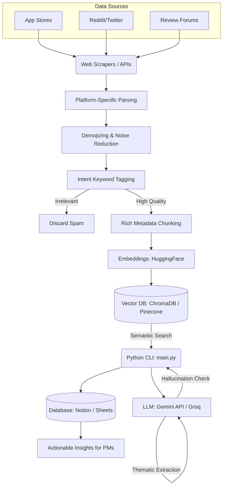

# System Architecture: Blinkit Pulse Behavioral Discovery Engine

## 1. High-Level Architecture Overview
The Blinkit Pulse Behavioral Discovery Engine is an automated, AI-native data pipeline designed to ingest unstructured qualitative user feedback, process it for relevance, analyze it for psychological and behavioral themes, and output structured, actionable insights. The architecture operates entirely without manual intervention once configured.

## 2. Component Breakdown

### Phase 1: Data Ingestion & Aggregation
**Goal:** Continuously collect user feedback across multiple disparate sources.
- **Sources:**
  - App Store & Google Play Store (App Reviews)
  - Social Media (Twitter/X mentions, Reddit threads in r/India, r/Bangalore, etc.)
  - Video Comments (YouTube reviews of Blinkit)
  - Consumer review websites (MouthShut, Trustpilot)
- **Mechanism:** Open-source Python scripts (e.g., BeautifulSoup, Google Play Scraper) and free API polling (YouTube Data API v3) to pull new feedback.
- **Data Payload:** Raw text, timestamp, source platform, author ID/username, rating (if applicable).

### Phase 2: Data Pre-Processing, Normalization & Chunking
**Goal:** Ensure only high-quality data reaches the LLM while preserving maximum semantic value and metadata.
- **Platform-Specific Parsing:** Resolve Reddit nested threads and clean Twitter handles while preserving hashtags.
- **Noise Reduction & Demojizing:** Translate emojis to text aliases (using Python `emoji` library) instead of stripping them, retaining high-density sentiment for the LLM.
- **Intent Pre-Filtering (Tagging):** Tag records with behavioral keywords (e.g., electronics, UI, delivery) to optimize RAG retrieval.
- **Spam Filtering:** Use heuristic rules to remove duplicate reviews and bot activity without aggressively stripping short valid feedback.
- **Hybrid Chunking & Lean Metadata:** Split massive text (e.g., long Reddit threads) using a 1000-character chunk size so short app reviews remain entirely whole. The final chunks are stripped of bloat and map only to essential fields (`rating`, `keyword_tags`, `text_chunk`).
- **Output:** A clean, tagged, and lean chunked JSON array.

### Phase 3: Embedding & Vector Storage
**Goal:** Enable semantic search and Retrieval-Augmented Generation (RAG) to bypass LLM context limits.
- **Embedding Generation:** Convert text chunks into high-dimensional vector representations using a free embedding model (e.g., HuggingFace `all-MiniLM-L6-v2`).
- **Vector Database:** Store these embeddings in a scalable Vector DB (e.g., Pinecone free tier or local ChromaDB) allowing the system to query thousands of reviews based on meaning (e.g., searching for "UI friction").

### Phase 4: AI Processing & Retrieval-Augmented Generation (RAG)
**Goal:** Extract behavioral themes using Large Language Models on demand.
- **Python Controller (`main.py`):** A single Python script orchestrates the pipeline, running sequentially when commanded by the user.
- **Semantic Retrieval:** The script queries the Vector DB for the most relevant context chunks related to the core business questions.
- **LLM Integration:** The retrieved context is passed to an advanced LLM with a free tier (e.g., Gemini API via Google AI Studio or Groq for Llama 3).
- **Prompt Engineering:** The LLM is primed with specific instructions to synthesize the retrieved context and identify reasons for habitual purchasing, UI/UX friction, external triggers, and user segments.

### Phase 5: Validation & Quality Control
**Goal:** Ensure insights are accurate, traceable, and devoid of AI hallucinations.
- **Clean Source-Linking:** The AI maps insights to sources via a dedicated JSON array (`corroborating_sources`) rather than cluttering the descriptive prose with review IDs.
- **Confidence Scoring:** The LLM assigns a confidence score to each extracted theme based on the volume of corroborating evidence in the dataset.

### Phase 6: Interactive Presentation (Streamlit UI)
**Goal:** Provide a live, interactive testing environment for the graduation judging panel.
- **Web App (`app.py`):** Wraps the `main.py` RAG pipeline in a Streamlit frontend. Allows users to type custom business questions and immediately see structured behavioral analysis.
- **Deployment:** Hosted on Streamlit Community Cloud, providing a public URL for zero-friction testing by stakeholders and judges.
- **Dashboarding:** Optional visualization layer using Looker Studio (free) to display trends over time (e.g., "Rise in friction regarding Pet Supplies").

---

## 3. Data Flow Diagram

## 4. Recommended Technology Stack (Free/Free-Tier Focus)
- **Scraping/Ingestion:** Python libraries (BeautifulSoup, google-play-scraper) and official APIs (YouTube Data API v3).
- **Processing & Vectorization:** HuggingFace `sentence-transformers` (free local embeddings) and ChromaDB (free local vector DB) or Pinecone (generous free tier).
- **Orchestration:** Simple Python CLI (`main.py`) triggered on-command by the user.
- **AI Processing:** Google Gemini API (generous free tier via Google AI Studio) or Groq (fast, free API for open-source models).
- **Database/Output:** Google Sheets (100% free) and Notion (robust free tier).
